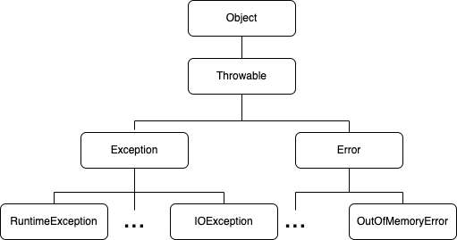
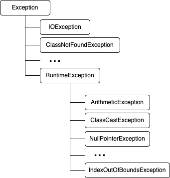

# Exception 
## 1.예외처리(exception handling)
### 1.1 프로그램 오류
* 에러 또는 오류는 발생 시점에 따라 컴파일 에러 (compile -time error) 와 런타임 에러 (runtime error) 로 나뉜다.      
  이 외에도 논리적 에러(logical error)가 있는데, 컴파일도 잘되고 실행도 잘되지만 의도한 것과 다르게 동작하는 것을 말한다.       1₩ =-098 
  예를 들어, 창고의 재고가 으뭇가 된다던가, 게임 프로그램에서 비행기가 총알을 맞아도 죽지 않는 경우이다.
  ```
    컴파일 에러 : 컴파일 시에 발생하는 에러
    런타임 에러 : 실행 시에 발생하는 에러
    논리적 에러 : 실행은 되지만, 의도와 다르게 동작하는 것
  ```
* 자바에서는 실행 시(runtime) 발생할 수 있는 프로그램 오류를 에러(error)와 예외(exception) 두 가지로 구분한다.
  에러는 메모리 부족(OutOfMemoryError)이나 스택오버플로우(StackOverflowError)와 같이 발생하면 복구할 수 없는 심각한 오류이고,        
  예외는 발생하더라도 수습될 수 있는 비교적 덜 심각한 것이다.
  ```
    에러(error)     : 프로그램 코드에 의해서 수습될 수 없는 심각한 오류
    에외(exception) : 프로그램 코드에 의해서 수습될 수 있는 다소 미약한 오류
  ```
### 1.2 예외 클래스의 계층구조
   

* 모든 예외의 최고 조상은 Exception클래스이며, 상속계층도를 Exception 클래스부터 도식화 하면 다음과 같다.     



* 예외 클래스들은 두 그룹으로 나눠질 수 있다.   
  ```
    1.Exception 클래스와 그 자손들 (RuntimeException과 자손들 제외)
      - 사용자의 실수와 같은 외적인 요인에 의해 발생하는 예외
      - FileNotFoundException, ClassNotFoundException, DataFormatException 등등..
    2.RuntimeException 클래스와 그 자손
      - 프로그래머의 실수로 발생하는 예외
      - NullPointerException, ClassCastException, ArrayIndexOutOfBoundsException 등등..   
  ```   
  
### 1.3 예외처리하기 -try-catch문
* 예외처리(exception handling)란, 프로그램 실행 시 발생할 수 있는 예기치 못한 예외의 발생에 대비한 코드를 작성하는 것이며,    
  예외처리의 목적은 예외의 발생으로 인한 실행중인 프로그램의 갑작스런 비정상 종료를 막고, 정상적인 실행상태를 유지할 수 있도록 하는 것이다.    
  [참고 : 에러와 예외는 모두 실행 시 (runtime) 발생하는 오류이다.]   
* 처리되지 못한 예외(uncaught exception)는 JVM의 예외처리기가 받아서 예외의 원인을 화면에 출력한다  
  ```java
    try{
        // 예외가 발생할 가능성이 있는 문장들을 넣는다.
    } catch (Exception e1){
        // Exception1이 발생했을 경우, 이를 처리하기 위한 문장을 적는다.
    } catch (Exception e2){
        // Exception2이 발생했을 경우, 이를 처리하기 위한 문장을 적는다.
    } catch (Exception eN){
        // ExceptionN이 발생했을 경우, 이를 처리하기 위한 문장을 적는다.
    }
  ```   
* 하나의 try 블럭 다음에는 하나 이상의 catch블럭이 올 수 있으며, 이 중 발생한 예외의 종류와 일치하는 단 한 개의 catch블럭만 수행된다.
  예외의 종류와 일치하는 catch블럭이 없으면 예외는 처리되지 않는다.   
* try블럭 또는 catch블럭에 또 다른 try-catch문이 포함될 수 있다.
  ```java
    package exception;
    
    public class ExceptionEx1 {
      public static void main(String[] args){
        try {
          try{}catch(Exception e){}
        } catch(Exception e){
          try{}catch(Exception e1){}
        }
    
        try {

        } catch (Exception e) {

        }
      }
    }  
  ```
* ArithmeticException 발생 예제   
  ```java
    package exception;
  
    public class ExceptionEx2 {
    public static void main(String args[]){
    int number = 100;
    int result = 0;
    
            for(int i=0; i < 10; i++) {
                result = number / (int) (Math.random() * 10);   // 9번째 라인
                System.out.println(result);
            }
        }
    }
    
    /* 실행결과
    
    Exception in thread "main" java.lang.ArithmeticException: / by zero
    at exception.ExceptionEx2.main(ExceptionEx2.java:9)
    
    */
  ```   
  
* try ~ catch 문으로 예외처리
  ```java
    package exception;
  
    public class ExceptionEx3 {
    public static void main(String args[]){
    int number = 100;
    int result = 0;
    
            for(int i=0; i < 10; i++) {
                try {
                    result = number / (int) (Math.random() * 10);   // 9번째 라인
                    System.out.println(result);
                }catch(ArithmeticException e) {
                    System.out.println("0");
                }
            }
        }
    }
    
    /* 실행결과
    20
    16
    0       <-- ArithmeticException 발생 구간
    20
    16
    12
    100
    50
    100
    33
    */    
  ```   
  
### 1.4 try-catch문에서의 흐름    
* try 블럭 내에서 예외가 발생한 경우,
  1. 발생한 예외와 일치하는 catch블럭이 있는지 확인한다.    
  2. 일치하는 catch블럭을 찾게 되면, 그 catch블럭 내의 문장들을 수행하고 전체 try-catch문을 빠져나가서 
     그 다음 문장을 계속해서 수행한다. 만일 일치하는 catch블럭을 찾지 못하면, 예외는 처리되지 못한다.   
* try 블럭 내에서 예외가 발생하지 않은 경우,    
  1. catch블럭을 거치지 않고 전체 try-catch문을 빠져나거서 수행을 계속한다.   
  
  ```java
    package exception;
    
    public class ExceptionEx4 {
      public static void main(String args[]){
  
        System.out.println(1);
        System.out.println(2);
  
        try{
          System.out.println(3);
          System.out.println(4);
        }catch(Exception e){
          System.out.println(5);
        }
      System.out.println(6);
      }
    }
    /*
    1
    2
    3
    4
    6
    */  
  ```
* try 블럭 내에서 발생
  1. try 블럭에서 예외가 발생하면, 예외가 발생한 위치 이후에 있는 try블럭의 문장들은 수행되지 않는다.
  
  ```java
    package exception;
    
    public class ExceptionEx5 {
      public static void main(String args[]){
        System.out.println(1);
        System.out.println(2);
        try{
          System.out.println(3);
          System.out.println(0/0);    //강제로 ArithmeticException 발생
          System.out.println(4);      //실행되지 않는다.
        }catch (ArithmeticException ae){
          System.out.println(5);
        }
      System.out.println(6);
      }
    }
    /*
    실행결과
    1
    2
    3
    5
    6
    */
  ```
  
### 1.5 예외의 발생과 catch블럭
* 예외가 발생하면, 발생한 예외에 해당하는 클래스의 인스턴스가 만들어 진다.   
* 첫 번째 catch 블럭부터 차례로 내려가면서 catch블럭의 괄호()내에 선언된 참조변수의 종류와 생성된 예외클래스의     
  인스턴스에 instanceof 연산자를 이용해서 검사하게 되는데, 검사결과가 true인 catch블럭을 만날 때 까지 검사는 계속된다.   
* 검사결과가 true인 catch블럭이 하나도 없으면 예외는 처리되지 않는다.  
* 모든 예외 클래스는 Exception 클래스의 자손이므로 catch절에 선언해 놓으면 어떤 종류의 예외가 발생하더라도     
  이 catch 블럭에 의해서 처리된다.   
  ```java
    package exception;
    
    public class ExceptionEx6 {
      public static void main(String args[]){
        System.out.println(1);
        System.out.println(2);
        try{
          System.out.println(3);
          System.out.println(0/0);    //강제로 ArithmeticException 발생
          System.out.println(4);      //실행되지 않는다.
        }catch (Exception e){         //ArithmeticException 대신 Exception 사용
          System.out.println(5);
        }
      System.out.println(6);
      }
    }
    /*
    실행결과
    1
    2
    3
    5
    6
    */
  ```
* try-catch문의 마지막에 Exception클래스 타입의 참조변수를 선언하면 어떤 종류의 예외가 발생해도       
  이 catch블럭에 의해 처리된다.
  ```java
  package exception;
  
  public class ExceptionEx7 {
      public static void main(String args[]){
          System.out.println(1);
          System.out.println(2);
          try{
              System.out.println(3);
              System.out.println(0/0);    //강제로 ArithmeticException 발생
              System.out.println(4);      //실행되지 않는다.
          }catch (ArithmeticException ae){
               if(ae instanceof ArithmeticException)
                   System.out.println("true");
              System.out.println("ArithmeticException");
          }catch (Exception e){           //ArithmeticException 제외한 모든 예외가 처리된다.
              System.out.println(5);
          }
          System.out.println(6);
      }
  }
  /*
   실행결과
      1
      2
      3
      true
      ArithmeticException
      6
   */
  
  ```
  
#### printStackATrae()와 getMessage()
* 예외가 발생했을 때 생성되는 예외 클래스의 인스턴스에는 발생한 예외에 대한 정보가 담겨 있으며, 
  getMessage()와 printStackTrace()를 통해서 이 정보들을 얻을 수 있다.
  ```
    printStackTrace() 예외발생 당시의 호출스택(Call Stack)에 있었던 메서드이 정보와 예외 메시지를 화면에 출력한다.
    getMessage()      발생한 예외클래스의 인스턴스에 저장된 메시지를 얻을 수 있다.
  ```
* 호출스택 정보과 예외 메시지 출력      
  ```java
    package exception;
    
    public class ExceptionEx8 {
        public static void main(String args[]){
            System.out.println(1);
            System.out.println(2);
            try{
                System.out.println(3);
                System.out.println(0/0);    //강제로 ArithmeticException 발생
                System.out.println(4);      //실행되지 않는다.
            }catch (ArithmeticException ae){
                ae.printStackTrace();
                System.out.println("예외메시지 : " + ae.getMessage());
            }
            System.out.println(6);
        }
    }
    /*
     실행결과
        1
        2
        3
        예외메시지 : / by zero
        6
        java.lang.ArithmeticException: / by zero
            at exception.ExceptionEx8.main(ExceptionEx8.java:9)
    순서가 이상하네 ?????
     */
  ```
#### 멀티 catch블럭   
* JDK1.7 부터 여러 catch블럭을 '|' 기호를 이용해서, 하나의 catch블럭으로 합칠 수 있게 되었으며,   
  이를 멀티 catch블럭 이라 한다.
  [참고 : 멀티 catch 블럭에 사용되는 '|'는 논리 연산자가 아니라 기호이다.]
  ```java
    try{
        ...
    }catch(ExceptionA e){
        e.printStackTrace();
    }catch(ExceptionB e2){
        e2.printStackTrace();
    }
            ↓
    try{
        ...
    }catch(ExceptionA | ExceptionB e){
        e.printStackTrace();
    }
  ```
* catch 블럭의 '|' 기호로 연결된 예외 클래스가 부모 자식 관계에 있으면 컴파일 에러가 발생한다. 
* 멀티 catch는 하나의 catch블럭으로 여러 예외를 처리하는 것이기 때문에, 실제로 어떤 예외가 발생한 것인지 알 수 없다.   
* interface로 상속받아 구현하거나 instanceof 로 비교해서 처리해야 한다.      
  ```java
    try{
            ...
    }catch(ExceptionA | ExceptionB e){
        e.methodA();        // 에러. ExceptionA에 선언된 methodA()는 호출불가
        
        if(e instanceof ExceptionA){
            ExceptionA e1 = (ExceptionA)e;
            e1.methodA();   // OK. ExceptionA에 선언된 메서드 호출가능.
        }else{              // if(e instanceof ExceptionB){
            ...
        }
        e.printStackTrace();
    }
  ```
### 1.6 예외 발생시키기 
* 키워드 throw를 사용해서 고의로 예외를 발생시킬 수 있다.
  ```java
    1.예외 클래스 객체 생성
        Exception e = new Exception("고의로 발생시켰음");        
    2.throw 를 이용해서 예외를 발생
        throw e;
  ```
  ```java
    package exception;
    
    public class ExceptionEx9 {
        public static void main(String args[]){
            try{
                Exception e = new Exception("고의로 발생시켰음.");
                throw e;    // 예외를 발생시킴
            //  throw new Exception("고의로 발생시켰음.");  위 두줄을 한줄로 표현
            }catch(Exception e){
                System.out.println("에러 메시지 : "+e.getMessage());
                e.printStackTrace();
            }
            System.out.println("프로그램이 정상 종료 되었음.");
        }
    }
    /* 실행결과
        에러 메시지 : 고의로 발생시켰음.
        프로그램이 정상 종료 되었음.
        java.lang.Exception: 고의로 발생시켰음.
            at exception.ExceptionEx9.main(ExceptionEx9.java:6)
     */
  ```    
* Exception 인스턴스를 생성할 때, 생성자에 String을 넣어 주면, 인스턴스에 메시지로 저장된다.     
  이 메시지는 getMessage()를 이용해서 얻을 수 있다.      

  ```java
    package exception;
    
    public class ExceptionEx10 {
        public static void main(String[] args){
            throw new Exception();      // Exception을 고의로 발생시킨다.
        }
    }
    /*
        java: unreported exception java.lang.Exception; must be caught or declared to be thrown
     */
  ```  
* Exception클래스들 (Exception클래스와 자손들)이 발생할 가능성이 있는 문장들에 대해 예외처리를 해주지 않으면 컴파일 조차 되지 않는다.   
  ```java
    package exception;
    
    public class ExceptionEx11 {
        public static void main(String[] args){
            throw new RuntimeException();      // RuntimeException을 고의로 발생시킨다.
        }
    }
    
    /* 실행결과
        Exception in thread "main" java.lang.RuntimeException
            at exception.ExceptionEx11.main(ExceptionEx11.java:5)
     */
  ```
* 위 예제는 예외처리를 하지 않았음에도 불구하고 이전의 예제와는 달리 성공적으로 컴파일될 것이다.     
  그러나 실행하면, 위의 실행결과처럼 RuntimeException이 발생하여 비정상적으로 종료될 것이다.    
  RuntimeException 클래스와 그 자손(RuntimeException 클래스들)에 해당하는 예외는 프러그래머에 의해     
  실수로 발생하는 것들이기 때문에 예외처리를 강제하지 않는 것이다. 만일 RuntimeException클래스들에 속하는     
  예외가 발생할 가능성이 있는 코드에도 예외처리를 필수로 해야 한다면, 아래와 같이 참조 변수 와 배열이 사용되는     
  모든 곳에 예외처리를 해 주어야 할 것이다.      
  ```java
    try{
        int[] arr = new int[10];
        System.out.println(arr[0]);
    }catch(ArrayIndexOutOfBoundsException ae){
        ...
    }catch(NullPointerException ne){
        ...
    }
  ```  
  컴파일러가 예외처리를 확인하지 않는     
  RuntimeException클래스들은 unchecked 예외 라고 부르고,     
  예외처리를 확인하는 Exception클래스들은 checked 예외 라고 부른다.    
  
###. 1.7 메서드에 예외 선언하기   
* 메서드에 선언부에 키워드 throws를 사용 예외가 여러 개일 경우에는 쉼표(,)로 구분   
  ```java
    void method() throws Exception1, Exception2, ... ExceptionN{
          // 메서드의 내용
    }
  ```
* JAVA API 문서를 통해 사용하고자 하는 메서드의 선언부와 Throws: 를 보고     
  처리해야 할 Exception 과 처리 해주지 않아도 될 RuntimeException은 어떤것들이 있는지 잘 확인해 보자.   
* thorws에 명시하는 것은 자신을 호출한 메서드에게 예외를 전달하여 예외처리를 떠맡기는 것이다.    
* 예외를 전달받은 메서드가 또다시 자신을 호출한 메서드에게 전달할 수 있으며, 이런 식으로 계속 호출스택에 있는   
  메서드들을 따라 전달되다가 제일 마지막에 있는 main메서드 에서도 예외가 처리되지 않으면, main메서드 마저 종료되어 프로그램이 전체가 비정상적으로 종료된다.   
  ```java
    package exception;
    
    public class ExceptionEx12 {
        public static void main(String[] args)throws Exception{
            method1();      // 같은 클래스내의 static멤버이므로 객체생성없이 직접 호출가능.
        }
        static void method1() throws Exception{
            method2();
        }
        static void method2() throws Exception{
            throw new Exception();
        }
    }
    
    /* 실행결과
        Exception in thread "main" java.lang.Exception
            at exception.ExceptionEx12.method2(ExceptionEx12.java:11)
            at exception.ExceptionEx12.method1(ExceptionEx12.java:8)
            at exception.ExceptionEx12.main(ExceptionEx12.java:5)
     */
  ```  
* 결국 어느 한 곳에서는 반드시 try-catch문으로 예외처리를 해주어야 한다.    
  ```java
    package exception;
    
    public class ExceptionEx13 {
        public static void main(String[] args)throws Exception{
            method1();      // 같은 클래스내의 static멤버이므로 객체생성없이 직접 호출가능.
        }
        static void method1() throws Exception{
            try {
                throw new Exception();
            }catch (Exception e){
                System.out.println("method1메서드에서 예외가 처리되었습니다.");
                e.printStackTrace();
            }
        }
    }
    
    /* 실행결과
        method1메서드에서 예외가 처리되었습니다.
        java.lang.Exception
            at exception.ExceptionEx13.method1(ExceptionEx13.java:9)
            at exception.ExceptionEx13.main(ExceptionEx13.java:5)
     */

    package exception;
    
    public class ExceptionEx14 {
        public static void main(String[] args)throws Exception{
            try {
                method1();
            }catch (Exception e){
                System.out.println("main메서드에서 예외가 처리되었습니다.");
                e.printStackTrace();
            }
        }
        static void method1() throws Exception{
            throw new Exception();
        }
    }
    
    /* 실행결과
        main메서드에서 예외가 처리되었습니다.
        java.lang.Exception
            at exception.ExceptionEx14.method1(ExceptionEx14.java:13)
            at exception.ExceptionEx14.main(ExceptionEx14.java:6)
     */
    
  ```  
* 아래 두 예제의 차이점은 예외의 처리방법에 있다. Ex15는 예외가 발생한 createFile 메서드 자체내에서 처리를 하며,    
  Ex16 은 createFile 메서드를 호출한 메서드(main 메서드)에서 처리한다.    
  예외가 발생한 메서드 내에서 자체적으로 처리해도 되는 것은 메서드 내에서 try-catch문을 사용해서 처리하고, 두 번째 예제처럼     
  메서드에 호출 시 넘겨받아야 할 값(fileName)을 다시 받아야 하는 경우(메서드 내에서 자체적으로 해결이 안 되는 경우)에는    
  예외를 메서드에 선언해서, 호출한 메서드에서 처리해야 한다.   
  ```java
    package exception;
    
    import java.io.File;
    
    public class ExceptionEx15 {
        public static void main(String[] args)throws Exception{
            // command line 에서 입력받은 값을 이름으로 갖는 파일을 생성한다.
            File f = createFile(args[0]);
            System.out.println(f.getName() + " 파일이 성공적으로 생성되었습니다.");
        }
        static File createFile(String fileName){
            try{
                if(null == fileName || "".equals(fileName)) {
                    throw new Exception("파일이름이 유효하지 않습니다.");
                }
            }catch(Exception e){
                // fileName이 부적절한 경우, 파일 이름을 제목없음.txt 로 한다.
                fileName = "제목없음.txt";
            }finally{
                File f = new File(fileName);        // File 클래스의 객체를 만든다.
                createNewFile(f);                      // 생성된 객체를 이용해서 파일을 생성한다.
                return f;
            }
        }
        static void createNewFile(File f){
            try{
                f.createNewFile();      // 파일을 생성한다.
            }catch (Exception e){}
        }
    }
    
    /* 실행결과
        //파라메터 text.txt
        test.txt 파일이 성공적으로 생성되었습니다.
    
        //파라메터 ""
        제목없음.txt 파일이 성공적으로 생성되었습니다.
     */
    
    package exception;
    
    import java.io.File;
    
    public class ExceptionEx16 {
      public static void main(String[] args)throws Exception{
        try {
          // command line 에서 입력받은 값을 이름으로 갖는 파일을 생성한다.
          File f = createFile(args[0]);
          System.out.println(f.getName() + " 파일이 성공적으로 생성되었습니다.");
        }catch (Exception e){
          System.out.println(e.getMessage()+" 다시 입력해 주시기 바랍니다.");
        }
      }
    
      static File createFile(String fileName)throws Exception{
        if(null == fileName || "".equals(fileName)) {
          throw new Exception("파일이름이 유효하지 않습니다.");
        }
        File f = new File(fileName);        // File 클래스의 객체를 만든다.
        f.createNewFile();                  // File 객체의 createNewFile 메서드를 이용해서 실제 파일을 생성한다.
        return f;
      }
    }
    
    /* 실행결과
        //파라메터 text.txt
        test2.txt 파일이 성공적으로 생성되었습니다.
    
        //파라메터 ""
        파일이름이 유효하지 않습니다. 다시 입력해 주시기 바랍니다.
     */
    
  ```  
### 1.8 finally 블럭
* finally 블럭은 예외의 발생여부에 상관없이 실행되어야할 코드를 포함시킬 목적으로 사용된다.     
  ```java
    try{
        // 예외가 발생할 가능성이 있는 문장들을 넣는다.    
    }catch(Exception1 e1){
        // 예외처리를 위한 문장을 적는다.
    }finally{
        // 예외의 발생여부에 관계없이 항상 수행되어야 하는 문장들을 넣는다. 
        // finally블럭은 try-catch문의 맨 마지막에 위치해야 한다.    
    }
  ```
* 예외가 발생한 경우에는 try -> catch -> finally의 순으로 실행되고, 예외가 발생하지 않은       
  경우에는 try -> finally의 순으로 실행된다.       
* finally 블럭 사용 예제
  ```java
    //finally 적용 전 
    package exception;

    public class FinallyTest {
        public static void main(String[] args){
            try{
                startInstall();     // 프로그램 설치에 필요한 준비를 한다.
                copyFiles();        // 파일들을 복사한다.
                deleteTempFiles();  // 프로그램 설치에 사용된 임시파일들을 삭제한다.
            }catch (Exception e){
                e.printStackTrace();
                deleteTempFiles();  // 프로그램 설치에 사용된 임시파일들을 삭제한다.
            }
        }
        static void startInstall(){}    // 프로그램 설치에 필요한 준비를 하는 코드를 적는다.
        static void copyFiles(){}       // 파일들을 복사하는 코드를 적는다.
        static void deleteTempFiles(){} // 임시파일들을 삭제하는 코드를 적는다.
    }

    //finally 적용 후
    package exception;
  
    public class FinallyTest2 {
      public static void main(String[] args){
        try{
          startInstall();     // 프로그램 설치에 필요한 준비를 한다.
          copyFiles();        // 파일들을 복사한다.
        }catch (Exception e){
          e.printStackTrace();
        }finally {
          deleteTempFiles();  // 프로그램 설치에 사용된 임시파일들을 삭제한다.
        }
      }
      static void startInstall(){}    // 프로그램 설치에 필요한 준비를 하는 코드를 적는다.
      static void copyFiles(){}       // 파일들을 복사하는 코드를 적는다.
      static void deleteTempFiles(){} // 임시파일들을 삭제하는 코드를 적는다.
    }
  
    // finally 호출 순서
    package exception;
  
    public class FinallyTest3 {
      public static void main(String[] args){
        // method1()은 static 메서드 라서 인스턴스 생성없이 직접 호출이 가능하다.
        FinallyTest3.method1();
        System.out.println("method1()의 수행을 마치고 main 메서드로 돌아왔습니다.");
      }
      static void method1(){
        try{
          System.out.println("method1()이 호출 되었습니다.");
          return;
        }catch (Exception e){
          e.printStackTrace();
        }finally{
          System.out.println("method1()의 finally 블럭이 실행되었습니다.");
        }
      }
    }
    
    /*  실행결과
        method1()이 호출 되었습니다.
        method1()의 finally 블럭이 실행되었습니다.
        method1()의 수행을 마치고 main 메서드로 돌아왔습니다.
     */
    
  ```
* 위의 예제 결과에서 알 수 있듯이, try 블럭에서 return문이 실행되는 경우에도 finally 블럭의     
  문장들이 먼저 실행된 후에, 현재 실행 중인 메서드를 종료한다.     
  이와 마찬가지로 catch블럭의 문장 수행 중에 return문을 만나도 finally블럭의 문장들은 수행된다.   
  
  
    