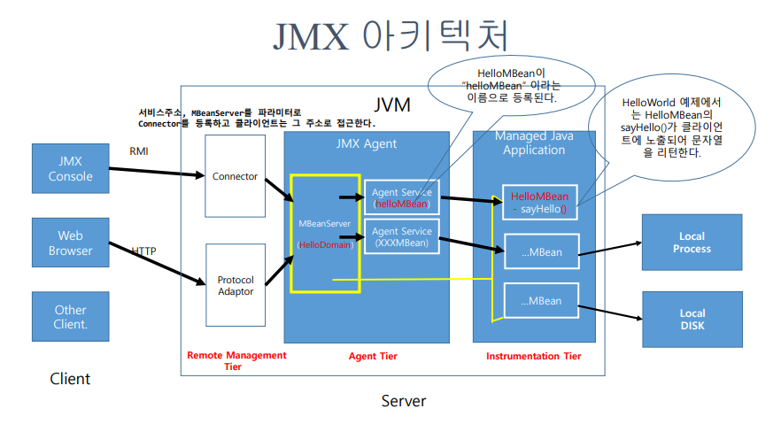

# JAVA 개요

## JMX란?
* JMX(Java Management Extensions)는 JAVA 응용프로그램의 모니터링과 관리기능을 제공합니다.
* 웹사이트를 통해 원격의 Web Server, WAS, DB등의 상태 모니터링, Start, Stop등의 기능, 디바이스 상태,    
각종 서비스제어 등의기능을 제공할 수 있습니다.
* JMX 기술을 사용하여 리소스를 관리하려면 Java 프로그래밍 언어로 리소스를 관리해야 하는데,    
MBeans로 알려진 Java 객체를 사용하여 리소스를 관리합니다.

## JMX MBean이란?
* JMX의 MBean은 JMX Agent를 통해 관리되는 응용프로그램 또는 시스템 리소스 입니다. 
* 표준 MBean은 XXXMBean이라는 Java 인터페이스와 해당 인터페이스를 구현하는 XXX라는 Java 클래스를 작성하여 정의됩니다. 
* 다음 규칙을 따라야합니다. 
  - 리소스의 상태는 getter와 setter를 통해 완전히 설명.
  - MBean은 최소한 하나의 public 생성자를 제공. 

## JMX 아키텍처 3레벨

* Instrumentation Tier (인스트러멘테이션 티어)      
  - MBean과 관리 가능한 리소스들을 포함합니다.        
  - 애플리케이션, 장치 또는 서비스와 같은 관리되는 리소스는 MBean(Managed Beans)이라는    
    Java 개체를 사용하여 관리 됩니다.   
  - MBean은 원격 관리 및 모니터링을위한 JMX Agent를 통해 관리되는데   
    속성 인터페이스를 클라이언트에 노출합니다.    
* Agent Tier
  - JMX Agent는 리소스를 직접 제어하고 원격 관리 애플리케이션(클라이언트)에서 
  사용할 수 있도록 하는 표준 Agent입니다.   
  - JMX Agent의 핵심 구성 요소는 MBean이 등록 된 서버 인 MBeanServer로 MBean의 등록 관리하기 위한     
  서비스들을 포함하고 있습니다. 즉 MBean을 위한 레지스트리 이며, 모든 클라이언트는 MBeanServer를    
  통해야 MBean을 다룰 수 있습니다.
  - JMX Agent는 리소스를 제어하고 클라이언트에서 접근할 수 있는 표준 Agent 입니다.  
* Remote Management(Distributed)Tier      
  - 리소스나 서비스를 관리하는(실제 어떤 서비스를 수행하는) 응용 프로그램이 JMX 에이전트와 
  통신 할 수 있도록 하는 구성 요소를 포함합니다.
  - 클라이언트가 접근 가능한 JMX Agent를 만드는 프로토콜 Adaptor와 Connector를 정의합니다.
  - MBeanServer는 프로토콜 Adaptor와 Connector를 이용하여 클라이언트 에서 JMX Agent에 액세스 할 수 있도록 합니다.
  - 프로토콜 Adaptor 및 표준 Connector를 사용하면 JMX Agent의 Java VM (Java Virtual Machine) 외부에 있는 
  원격 관리 애플리케이션(클라이언트)에서 JMX Agent에 접근할 수 있습니다.

## JMX Sample
* “HelloWorld”
  - HelloMBean.java (Mbean Interface)
  - Hello.java (MBean Interface 구현체)
  - HelloAgent.java (JMX Agent)
  - HelloClient.java(JMX Client)

