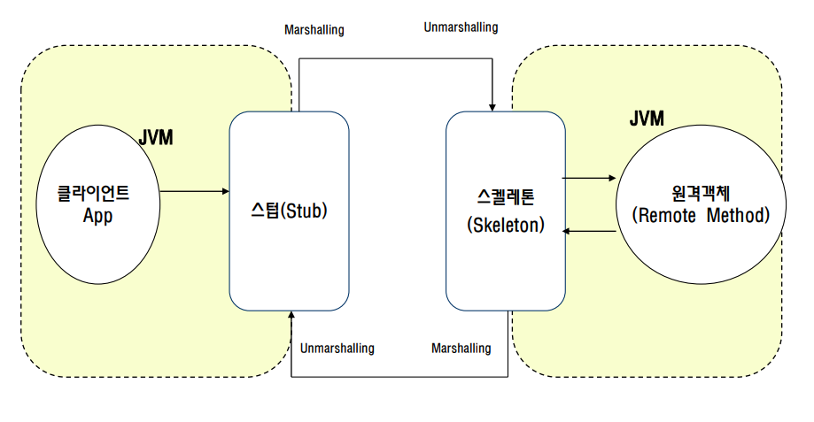

# JAVA RMI 개념

## RMI(Remote Method Invocation) 
* 직렬화 된 Java 클래스의 전송, 원격 프로시저 호출 (RPC)과 같은 객체 지향적 인 원격 메서드 호출을 수행하는 Java API
* 기존 자바언어의 장점과 풍부한 API를 분산 객체 기술에 이용이 가능하게 됨       
* 다른 실행 환경에 있는 객체의 메소드를 로컬에서 생성한 객체의 메소드와 다름 없이 호출할 수 있도록 하는 
  “자바의 분산 객체 기술” 이다.
* RMI를 사용하면 객체가 다른 JVM에서 실행중인 객체의 메서드를 호출 할 수 있다.  
* RMI 스펙에 대한 구현은 JRMP (Java RemoteMethod Protocol) 이다.    
* Distributed computing model을 구현하기 위한 자바 Object 간의 통신을 구현한 도구이다.  
* RMI는 두 개의 객체 스텁 및 스켈레톤을 사용하여 애플리케이션 간의 원격 통신을 제공한다.    

## 스텁(Stub)    
* 스텁은 객체이며 클라이언트 측의 게이트웨이 역할을 한다.
* 모든 나가는 요청은 Stub 통해 라우팅 된다.
* 클라이언트 측에 위치하며 원격 개체를 나타내는데 실제 원격객체가 아니라 원격 객체의 껍데기 이다.
* 클라이언트가 Stub 객체에서 메서드를 호출하면 다음 작업을 수행한다.
    - 원격 가상 머신 (JVM)과의 연결을 시작한다.
    - 원격 가상 머신 (JVM)에 매개 변수를 쓰고 전송 (마샬링, 직렬화)합니다.
    - 결과를 기다린다
    - 반환 값 또는 예외를 읽는다.(언마샬링, 역직렬화)
    - 마지막으로 클라이언트에게 값을 반환합니다.        


## 스켈레톤(Skeleton)
* Skeleton 은 객체이며 서버 측의 게이트웨이 역할을 한다.
* 서버로 들어오는 모든 요청은 Skeleton을 통해 라우팅 된다.
* Skeleton 이 수신 요청을 받으면 다음 작업을 수행한다.
    - 원격 메소드의 매개 변수를 읽는다.
    - 실제 원격 개체에서 메서드를 호출한다.
    - 결과를 작성하고 호출자에게 전송 (마샬링, 직렬화)한다.
    - Java 2 SDK에서는 스켈레톤이 필요없는 스텁 프로토콜이 도입되었다.    

## RMI Concept    


## RMI 작성 과정 – 원격 인터페이스 정의
* 원격 객체 사이의 메시지 전송을 위한 것
* 자바 RMI에서는 RMI 클라이언트와 RMI 서버간의 메시지 전송을 위한 방법으로 자바의 인터페이스를 이용한다.    
 즉 인터페이스에서 정의한 메소드로 클라이언트와 서버간의 통신이 이루어 진다.
 ```java
  public interface Hello extends java.rmi.Remote {
      public String sayHello(String name) throws
      java.rmi.RemoteException;
  }
 ```

## RMI 작성 과정 – 원격 인터페이스 구현클래스 정의(servant)
* 원격 인터페이스에서 정의한 메소드를 구현 한클래스(이것이 원격객체 이다. 원격에서 호출가능한 객체.)
```java
  public class HelloImpl extends UnicastRemoteObject implements Hello {
      public HelloImpl() throws RemoteException {
          super();
      }

      //원격 메소드 구현
      public String sayHello(String name) {
          return "Hello World ... " + name + "!";
      }
  }
```


## RMI 작성 과정 – RMI 서버 App 작성
* 원격 인터페이스를 구현한 클래스(원격객체)의 인스턴스를 생성하고 이를 원격의 RMI 클라이언트가 접근하여 구현된  
  비즈니스 메소드를 원격 호출 할 수 있도록 하는 프로그램 이다.
* 즉 원격 인터페이스를 구현한 클래스의 인스턴스를 생성하고 이를 원격의 클라이언트가 접근할 수 있도록 이름으로 
  등록하는 일을 담당하는 프로그램
```java  
  HelloImpl remoteObj = new HelloImpl();
  java.rmi.Naming.rebind("rmi://localhost:1099/HelloRemote", remoteObj);
```

## RMI 작성 과정 – RMI 클라이언트 App 작성
* RMI 서버 Application이 생성한 원격 객체를 접근함으로써 원격 인터페이스에 정의된 비즈니스 메소드를 필요에 따라 
  호출하는 프로그램
```java
  Object obj = Naming.lookup("rmi://localhost:1099/HelloRemote");
  Hello remoteObj = (Hello)obj;
  String msg = remoteObj.sayHello(args[0]);
  System.out.println(msg);
```

# JAVA RMI 실습

## RMI “Hello World” RMI Application
* 하나의 RMI Application을 작성 하기 위해서는 3~4개 정도의 자바 파일이 필요 하다.
* 필요한 파일 (구조)
  - 원격 인터페이스 : 자바 인터페이스
  - 원격 인터페이스를 구현한 클래스(원격객체) : 클래스
  - RMI 서버 Application : 클래스
  - RMI 클라이언트 Application : 클래스

## 1. “Hello World” – 원격인터페이스
* 원격 인터페이스는 원격 객체에 대하여 클라이언트가 호출할 수 있는 비즈니스 메소드를 정의 한다.   
  (원격객체가 구현할인터페이스)   
* 클라이언트는 원격 인터페이스에서 정의된 메소드만 서로 다른 실행환경에서 원격으로 호출 할 수 있다.   
* 이렇게 원격에서 호출 가능한 메소드를 “원격 메소드” 라고 한다.   
* Hello.java 에서는 sayHello() 라는 원격 메소드를 정의 하고 있고 java.rmi.Remote 인터페이스를   
  직/간접적으로 상속해야 한다. (보통 직접 상속 한다.)  
* 이클립스에서 “rmi” 라는 자바프로젝트 생성     
* Hello.java    
```java
  package server;
  public interface Hello extends java.rmi.Remote {
    public String sayHello(String name) throws java.rmi.RemoteException;
  }
```
* 원격 인터페이스에서 정의한 모든 메소드는 java.rmi.RemoteException이나     
부모클래스(java.io.IOException, java.lang.Exception)을 throws해야 한다.     
(RMI 스펙에는 RemoteException을throws 하도록 권고 하고 있다.)   

## 2. “Hello World” – 원격 인터페이스를 구현한 클래스   
* HelloImpl.java는 원격 인터페이스 Hello를 구현한 클래스이며 HelloImpl 클래스의 인스턴스가    
원격객체로서 RMI 서버에 의해 이름으로 등록된다.     
* "Hello World” Application 에서는java.rmi.UnicastRemoteObject 를 상속하며 원격이터페이스를 구현하고 있다.    
* HelloImpl.java
```java
  package server;
  import java.rmi.server.*;
  import java.rmi.*;
  public class HelloImpl extends UnicastRemoteObject implements Hello {
      public HelloImpl() throws RemoteException {
          super();
      }
      //원격 메소드 구현
      public String sayHello(String name) {
          return "Hello World ... " + name + "!";
      }
  }
```
* RMI 서버 Application은 원격 인터페이스 구현 클래스의 인스턴스를 생성하여 이를 rmiregistry에 이름으로 등록 한다.   
* 원격 객체는 자신을 원격의 클라이언트가 접근 할 수 있도록 등록 할 수 있어야 하며 클라이언트에서 원격 메소드    
요청이 발생 했는지 지속적으로 모니터링 할 수 있어야 한다. 아쉽게도 원격 인터페이스에는 이러한 기능은 정의되지 않았다.   
* HelloImpl 객체가 원격 객체로 작동 할 수 있는것은 원격메소드를 구현해서가 아니라     
java.rmi.server.UnicastRemoteObject를 상속했기 때문이다.      
* java.rmi.server.RemoteObject, java.rmi.server.RemoteServer 클래스에서 정의하는 기능을 가져야 한다.    
  - 원격객체는 RMI 스펙에서 제안하는 규격에 맞게 java.lang.Object에서 상속한 hashCode, equals, toString 메소드를    
  재정의 할 필요가 있으며 원격객체임을 RMI 시스템에 알리고 자신을 원격 객체로 rmiregistry에 등록 할 수 있어야 한다.
  - RemoteObject 클래스는 hashCode, equals, toString을 RMI에 맞게 재정의 하고 있으며 RemoteServer 클래스는    
  원격 클라이언트에서 오는 원격 메소드 호출을 처리하는 기능을 정의 하고 있다.
  - 이 두개의 클래스 RemoteObject와 RemoteServer의 기능을 동시에 가지고 있는 클래스가 UnicastRemoteObject 클래스이며    
  일반적으로 원격 인터페이스를 구현한 클래스(RMI 원격 객체 클래스)는 UnicastRemoteObject를 상속한다.    
  그러나 반드시 상속해야 하는 것은 아니며 기능을 구현한 다른 클래스를 상속해도 무방하다.    
* 원격 객체 기능 구현을 위해 java.rmi.server.RemoteObject 클래스를 상속한 경우 에는 default 생성자를 반드시 정의 해야 한다.
  - UnicastRemoteObject 클래스는 자신의 생성자에서 원격 객체를 등록하는 기능을 정의하고 있다.
  - 왜 반드시 해야할까? (생성자에서 throws 하는 이유)   
  => 안하면 컴파일시 에러가 발생한다. 상속받는 UnicastRemoteObject의 생성자가 RemoteException을 throws 하고 있으므로    
  하위 클래스인 “원격 인터페이스 구현 클래스”의 생성자에서도 RemoteException을 throws 해야 한다
* 원격 인터페이스에서 정의하는 원격 메소드 이외의 메소드도 정의가 가능하다. 
  - 원격 메소드 이외의 메소드는 오로지 Local의JVM에서만 호출이 가능 하다.
  

## 3. “Hello World” – RMI 서버 Application
* HelloServer.java의 경우 RMI 서버 Application의 기능만을 정의한 단순한 클래스 이다.    
* HelloImpl 객체(원격객체)를 생성하고 “HelloRemote”라는 이름으로 등록하며 이후 RMI 클라이언트에서의 메소드 호출을 기다린다.     
* 원격 객체를 생성/등록 하기 위해서는 Naming클래스의 static 메소드인 bind(…)나 rebind(…)를 사용하다.    
* HelloServer.java
```java
  package server;
  public class HelloServer {
      public static void main(String[] args) {
          try {
              HelloImpl remoteObj = new HelloImpl();
              java.rmi.Naming.rebind("rmi://localhost:1099/HelloRemote", remoteObj);
              System.out.println("Hello Remote Object bound to the registry and ready to service incoming client calls...");
          } catch(java.rmi.RemoteException e) {
              System.err.println("Exception occurred during processing incoming method call");
          } catch(java.net.MalformedURLException e) {
              System.err.println("Check the url String...");
          }
      } 
  }
```
## 4. “Hello World” – RMI 클라이언트 Application    
* HelloClient.java
```java
  package client;
  import java.rmi.Naming;
  public class HelloClient {
      public static void main(String[] args) {
          try {
              Object obj = Naming.lookup("rmi://localhost:1099/HelloRemote");
              Hello remoteObj = (Hello)obj;
              String msg = remoteObj.sayHello(args[0]);
              System.out.println(msg);
          }catch(java.rmi.RemoteException e) {
              System.out.println("Something has gonewrong during remote method call...");
          }catch(java.rmi.NotBoundException e) {
              System.out.println("Could't bound...");
          }catch(java.net.MalformedURLException e) {
              System.out.println("Check url stirng...");
          }
      }
  }
```
* RMI 서버 Applcation 에서 등록한 원격객체 “HelloRemote” 에 대한 reference를 얻고 있는 부분     
을 제외하면 실제 로컬의 런타임 환경에서 생성한 객체와 전혀 다를 바 없는 레퍼런스를 사용한 메소드 호출을 하고 있다.    
* RMI에서 원격객체를 생성하고 이를 이름으로 등록한 후 원격 객체에 대한 클라이언트의 서비스 요청을 기다리는 쪽이 서버 이다.    
* 원격 객체를 이름으로 찾아 해당 객체가 제공하는 원격 메소드를 호출하는 프로그램이 RMI 클라이언트 이다.   
* 원격 객체에 대한 레퍼런스(원격 레퍼런스)를 이름을 통해 얻어 낼 수 있도록 rmiregstry 라는 네이밍 서버 데몬을 제공 한다.
* 원격 참조(레퍼런스)를 통해 서로 다른 JVM 환경의 원격 메소드를 자신의 로컬 JVM 환경에서 생성한 객체와 다름없이 호출 할 수 있는 
메커니즘(stub, skeleton)을 제공 한다.
* 원격 객체의 메소드 호출 시 객체를 주고 받을 수있는 메커니즘을 제공한다.     
(원격 객체 메소드 호출시 사용되는 파라미터나 리턴 타입이Serializable을 구현했을 경우 객체 직렬화를 이용가능)
* RMI에서 pass-by-value이 경우는 원격 메소드 호출시 사용하는 파라미터나 리턴 타입에 적용 되며 pass-by-reference인 경우는 
원격객체에 대한 레퍼런스 이다.    
* 다음 코드에서 remoteObj가 Hello 타입의 원격 레퍼런스다.
```java
  //HelloClient.java
  Object obj = Naming.lookup("rmi://loclahost:1099/HelloRemote");
  Hello remoteObj = (Hello)obj;
```
* RMI는 원격 객체에 대한 참조로 stub을 사용한다. 즉 RMI 클라이언트 Application에서 사용하는 원격 객체의 reference는 실제로
stub에 대한 reference 이다.   
* 하나의 JVM에서 생성한 객체를 다른 JVM에서 그대로 실행 한다는 것은 불가능 하다.(주소 공간이 틀리기 때문) , 즉 이것이   
RMI에서 원격 객체에 대한 참조를 원격객체를 직접 가리키지 않고 stub을 사용하는 이유이다.   
* 예를들면 RMI 클라이언트에서 RMI 서버의 메소드를 호출 한다고 했을 때 먼저 로컬 stub 객체에 먼저 전달된 후에    
원격의 skeleton 객체에 전달되고 skeleton이 실제 객체의 비즈니스 메소드를 호출하는것이다.    
* 원격 메소드 호출시에 사용하는 실매개변수와 리턴되는 데이터의 상태를 원격의 클라이언트/서버 간에 유지할 필요가 없을때는    
직렬화(Serialization)를 통해 Pass-by-value로 복사본을 주고 받는다.    
(객체나 자바 내장 데이터 타입인 경우 객체 직렬화를 사용한다.)   
* 자바 RMI의 경우 서버에서 이름으로 등록한 원격 객체를 클라이언트에서 개발자가 직접 저수준의 네크웍 코드를 직접 작성하지    
않고 등록된 이름으로 원격에 존재하는 비즈니스 객체를 참조 할수 있도록 rmiregistry라는 Naming Server Daemon을 제공 한다.

## Stub & Skeleton    
* 자바 RMI에서 원격 객체의 메소드를 호출해서 사용하기 위해 다른 메모리 공간(JVM)에 존재하는   
원격 객체에 대한 클라이언트쪽 참조(레퍼런스)로서 원격 객체 자체에 대한 레퍼런스를 사용하지 않   
고 원격 객체에 대한 stub을 참조를 사용한다.
* 이는 자신이 실행되는 JVM과 다른 메모리 공간에 존재하는 객체의 참조(주소, 포인터)는 의미가 없기 때문이다.
* RMI 클라이언트는 stub 참조를 통해 원격 메소드를 호출하고 stub 은 호출시에 넘어오는 메소드 명이나 파라   
미터등을 적절한 형태로 packaging 하여 네트웍을 통해 RMI 서버 Application의 원격 객체에 대한 Skeleton에 전달한다.
* RMI 서버에서는 이를 다시 unpackaging 하여 원격메소드 명과 파라미터등을 알아내어 실제 원격 객체의 메소   
드에 전달 한다. 원격메소드의 실행이 완료되어 return하면 Skeleton은 다시 이 결과를 packaging하여 네트웍을 통해     
클라이언트의 stub에게 전송 한다. 이를 packaging하는것을 marshalling, 반대로 unpackaging하는것을 unmarshalling이라 한다.   
    

## 원격 객체와 Stub
* RMI 클라이언트는 원격 객체의 원격 메소드 만을 호출 할 수 있으며 이 호출을 위해 실제의 원격객체에    
대한 참조 대신 원격 객체의 stub reference를 이용한다고 하였다. 이는 곧 원격객체가 구현한 모든 원격    
메소드를 원격객체에 대한 stub 객체도 함께 가지고있다는 것을 의미 한다.(물론 동일 한 것은 아니다.)   
* 앞서 작성한 “Hello World”의 경우 HelloImpl은 원격인터페이스 Hello를 구현한 원격 객체 클래스 이며    
이를 통해 rmic를 통해 작성된 HelloImpl_stub 역시HelloImpl과 동일한 Hello를 구현 한 클래스 이다.     
* 앞서 작성한 “Hello World”의 클라이언트 Application인 HelloClient.java를 살펴보면 lookup 메소드를 통해   
Return되는 실제 객체는 HelloRemote라는 이름으로 등록된 원격객체 HelloImpl 객체에 대한 stub인 HelloImpl_stub   
객체가 Return 될 것이다.
* 또한 stub reference인 remoteObj를 Hello로 캐스팅 가능한 이유는 remoteObj가 참조하는 stub 객체인   
HelloImpl_stub이 Hello 인터페이스를 구현 했기 때문이다.   
* javap HelloImpl_stub 명령을 통해 stub 객체의 메소드 를 확인하는 것은 가능하다.    

## 객체 직렬화
* 원격 객체에 대한 reference가 실제로 원격 객체에 대한 stub 객체를 통해 클라이언트에 참조로     
전달된다면(원격객체에 대한 참조가 stub 참조로 전달되는 경우) 참조로 전달되는 원격 메소드의 파라미터나 반환    
데이터는 복사본이 전송된다(pass-by-value) 이때 RMI는 객체 직렬화를 이용 한다.   
* 결국 marshalling과 unmarshalling은 객체 직렬화와 환원이다.    
* 그러므로 기본적으로 원격 메소드의 파라미터나 리턴 타입은 객체 직렬화가 가능 해야 한다.        
* 자바에서 직렬화가 가능한 조건은 다음과 같다.
  - java.io.Serializable 인터페이스를 직/간접적으로 구현해야 한다.
  - 내장 데이터 타입은 기본적으로 직렬화 가능하다.
  - 멤버변수에 transient로 선언하면 직렬화에서 제외된다.    
  (멤버 변수중 직렬화가 불가능한 변수등이 있을 경우 객체 자체가 직렬화 되지 못하는 오류가 발생 할 수 있으므로 이를 해결하기 위해        
  “이 멤버는 직렬화에서 제외 하세요” 라는 뜻이다.)      
  - static 멤버 변수는 직렬화 되지 않는다.      
* “Hello World” RMI Application에서 Hello.java의 원격메소드인 sayHello를 살펴보자. RMI 클라이언트에서   
stub을 통해 sayHello 메소드를 호출시 name pass-by-value방식으로 복사되어 원격 서버로 전송된다. 이때   
파라미터 name은 형이 String이므로 직렬화 되어 전송된다.       
* 만약 직렬화 불가능한 파라미터등이 전달된다면 java.rmi.MarshalException 이 발생 한다.        
* sayHello의 반환 값 역시 Skeleton을 통해 클라이언트의 stub으로 직렬화 되어 전송된다.       
만약 sayHello의return 형이 Serializable을 구현하지 않았다면java.rmi.MarshalException 이 발생 한다.    
* 조금만 더 깊이 들어가 보자… 자바 RMI에서 원격메소드의 호출은 stub/skeleton을 통해 이루어지며      
데이터 전송을 위해서는 marshalling과 unmarshalling을 한다고 했으며 이는 직렬화 및 환원 과정 이라고 했다.  
* 결국 stub과 skeleton에서는 직렬화 및 환원을 위해 ObjectOutputStream과 ObjectInputStream이 필요하다는 것에 대해 감을 잡았을 것이다.      
다시 말하면 marshalling을 위해 ObjectOutputStream.writeObejct(…) , unmarshalling을 위해 ObjectInputStream.readObject(…)를 사용한다.    